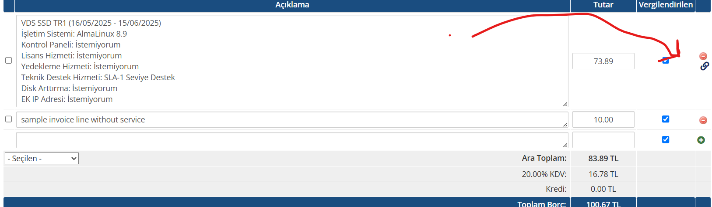

# WHMCS-Invoice-Go-To-Service-Button
A WHMCS admin hook that adds a quick "Go to Service" button next to invoice items on the invoice details page, linking directly to the related service for easy management.

# WHMCS Invoice Item Service Link Button

This WHMCS hook adds a convenient "Go to Service" button next to each invoice item on the admin invoice details page. The button links directly to the associated service management page for quick access.

## Features

- Automatically detects related services for invoice items.
- Adds a small Font Awesome icon button in the last column of invoice item rows.
- Works for all types of services (shared hosting, VPS, etc.) linked to the invoice.
- Opens the service page in a new tab.
- Minimal impact and easy to install via a single hook file.

## Installation

1. Place the hook PHP file in the `includes/hooks` directory of your WHMCS installation.
2. Clear template cache and refresh the admin invoice details page.
3. Open any invoice in the admin area to see the "Go to Service" icon next to invoice items.

## Requirements

- WHMCS 8.x (tested on 8.4)
- Admin area Font Awesome support (default WHMCS admin theme)

## Usage

No additional configuration needed. The hook automatically works on invoice details pages.

## Example

